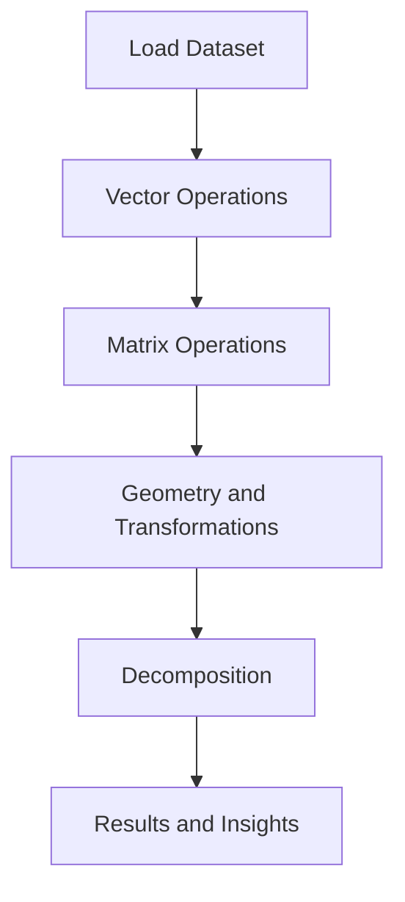

<div align="center">

# Calculative Foundation Mathematics

### Applied Linear Algebra on Real Student Data using Python

<br>

<p align="center">


</p>

<br>

<a href="Calculative_Foundation_Practical.ipynb">

</a>
&nbsp;
<a href="Calculative%20Foundation%20Theory.pdf">

</a>
&nbsp;
<a href="Student_Performance_Dataset.csv">

</a>

</div>

---

## Overview

> **What if you could see student performance as geometry?**

This project applies **linear algebra, vector math, and matrix decomposition** to a real dataset of **25,000 students**. It bridges the gap between mathematical theory and practical implementation. Every concept is demonstrated with Python code, visualizations, and clear interpretations.

The project has two parts:

| Section | Description |
|---------|-------------|
| Theory (PDF) | Covers definitions, formulas, proofs, and visual explanations of every concept |
| Practical (Notebook) | Hands-on Python implementation with code, output, and interpretation |

---

## Dataset Information

This project uses a **Student Performance Dataset** containing academic and demographic data for 25,000 students.

| Property | Details |
|:---------|:--------|
| File | `Student_Performance_Dataset.csv` |
| Size | 25,000 rows, 14 columns |
| Analysis Focus | `math_score`, `science_score`, `english_score` |
| Matrix Shape | 25000 x 3 (score matrix) |
| Language | Python 3.x |

### Column Details

| # | Column | Type | Description |
|:-:|--------|------|-------------|
| 1 | `student_id` | int | Unique identifier |
| 2 | `age` | int | Student age (14-18) |
| 3 | `gender` | str | Gender category |
| 4 | `school_type` | str | Public or Private |
| 5 | `parent_education` | str | Educational background of parents |
| 6 | `study_hours` | float | Daily study hours |
| 7 | `attendance_percentage` | float | Class attendance percentage |
| 8 | `internet_access` | str | Yes or No |
| 9 | `travel_time` | str | Commute duration |
| 10 | `extra_activities` | str | Extracurricular participation |
| 11 | `math_score` | float | Math marks (Vector component 1) |
| 12 | `science_score` | float | Science marks (Vector component 2) |
| 13 | `english_score` | float | English marks (Vector component 3) |
| 14 | `overall_score` | float | Aggregate performance score |

> **Core Idea:** Each student's three subject scores become a 3D vector, turning performance comparison into a geometry problem.

---

## Project Workflow



---

## Topics Covered

| # | Part | Topic |
|:-:|------|-------|
| 01 | Part A | Score Vectors |
| 02 | Part A | L1 and L2 Norms |
| 03 | Part A | Dot Product and Angle |
| 04 | Part A | Cross Product |
| 05 | Part A | Vector Projection |
| 06 | Part B | Matrix Formation |
| 07 | Part B | Matrix Addition and Multiplication |
| 08 | Part B | Transpose |
| 09 | Part B | Covariance Matrix and Inverse |
| 10 | Part B | Determinant |
| 11 | Part C | Line, Plane, Hyperplane |
| 12 | Part C | Dimensionality Visualization |
| 13 | Part C | Linear Transformations |
| 14 | Part D | Eigenvalues and Eigenvectors |
| 15 | Part D | LU Decomposition |
| 16 | Part D | Systems of Equations |

---

## Technologies Used

| Technology | Role |
|:----------:|:----:|
| Python | Core programming language |
| NumPy | Vector and matrix computation |
| Pandas | Data loading and manipulation |
| SciPy | Linear algebra functions (LU, linalg) |
| Matplotlib | 2D and 3D visualization |
| Seaborn | Statistical plotting |
| Jupyter Notebook | Development environment |

---

## Quick Start

```bash
# Clone the repository
git clone https://github.com/DevanshiBachhote2007/Calculative_Foundation_Maths.git
cd Calculative_Foundation_Maths

# Install dependencies
pip install numpy pandas scipy matplotlib seaborn

# Launch the notebook
jupyter notebook Calculative_Foundation_Practical.ipynb
```

---

## Learning Outcomes

After completing this project, you will understand:

- How to represent real data as vectors and matrices
- How to compute norms, dot products, angles, and projections
- How to perform matrix addition, multiplication, transpose, and inverse
- How to interpret covariance matrices and determinants
- How dimensionality increases from 1D to higher dimensions
- How to apply linear transformations to datasets
- How to decompose matrices using LU factorization
- How to solve systems of linear equations with Python
- How to connect abstract math to real educational data

---

## Real-World Applications

| Industry | Use Case |
|----------|----------|
| Education | Student clustering, performance prediction |
| Machine Learning | PCA, dimensionality reduction, SVMs |
| Finance | Portfolio optimization, risk analysis |
| Computer Graphics | 3D rendering, transformations, game physics |
| Healthcare | Medical data analysis, outcome modeling |
| Manufacturing | Quality control, process optimization |

---

# Notebook Walkthrough

This section provides a structured walkthrough of the complete notebook. Each step includes a short explanation and the corresponding Python code used in the analysis.

> Tip: Follow the notebook in order to reproduce the same workflow.

---

# Step 1 - Import Libraries and Load Dataset

All the essential libraries for linear algebra and visualization are imported, and the student dataset is loaded.

```python
# Import libraries
import pandas as pd
import numpy as np
import statistics as stats
import math
import scipy
from scipy import linalg
import matplotlib.pyplot as plt
import seaborn as sns
from scipy.linalg import lu

# Load dataset
df = pd.read_csv("Student_Performance_Dataset.csv")

# Display first 5 rows
print(df.head())

# Convert to NumPy matrix for linear algebra operations
M = df.values
print("Matrix shape:", M.shape)
```

> Output:


---

# Step 2 - Represent Student Scores as Vectors

Each student's subject scores (Math, Science, English) are extracted as a 3D vector.

```python
# Student Vectors
student1 = df.loc[0,['math_score', 'science_score', 'english_score']].to_numpy(dtype=float)
student2 = df.loc[1,['math_score', 'science_score', 'english_score']].to_numpy(dtype=float)
student3 = df.loc[2,['math_score', 'science_score', 'english_score']].to_numpy(dtype=float)

print("Student 1 vector:", student1)
print("Student 2 vector:", student2)
print("Student 3 vector:", student3)
```

> Output:


---

# Step 3 - Compute L1 and L2 Norms

The L1 norm gives total sum of scores, and L2 norm gives the geometric magnitude.

```python
## Norm 1
l1_student1 = np.linalg.norm(student1, ord=1)
l1_student2 = np.linalg.norm(student2, ord=1)
l1_student3 = np.linalg.norm(student3, ord=1)

print("Student 1 L1 Norm:", l1_student1)
print("Student 2 L1 Norm:", l1_student2)
print("Student 3 L1 Norm:", l1_student3)

## Norm 2
l2_student1 = np.linalg.norm(student1)
l2_student2 = np.linalg.norm(student2)
l2_student3 = np.linalg.norm(student3)

print("\nStudent 1 L2 Norm:", l2_student1)
print("Student 2 L2 Norm:", l2_student2)
print("Student 3 L2 Norm:", l2_student3)
```

> Output:


---

# Step 4 - Dot Product and Angle Between Students

The dot product measures similarity, and the angle shows how closely two students' performance patterns align.

```python
# Dot product between two students' score vectors
dot_product = np.dot(student1, student2)
print("Dot Product of Student1 and Student2:", dot_product)

# Angle between two students' score vectors
cos_theta = dot_product / (l2_student1 * l2_student2)
angle = np.degrees(np.arccos(cos_theta))
print("Angle between Student1 and Student2 =", angle)
```

> Output:


---

# Step 5 - Cross Product

The cross product shows the direction of difference between two students in 3D subject space.

```python
## Cross Product
crossproduct = np.cross(student1, student2)
print("Cross Product of Student1 and Student2:", crossproduct)
```

> Output:


---

# Step 6 - Vector Projection

The projection shows how much of Student 1's performance aligns with Student 2's direction.

```python
# Projection Vector
proj = (dot_product / np.dot(student2, student2)) * student2
print("Projection of Vector:", proj)
```

> Output:


---

# Step 7 - Form the Score Matrix

A matrix of students x subjects is created for matrix operations.

```python
# Making Matrix
matrix = df[['math_score', 'science_score', 'english_score']].values
print("Student Score Matrix:", matrix)
```

> Output:


---

# Step 8 - Matrix Addition and Multiplication

Matrix addition scales values, and multiplication reveals subject correlations.

```python
# Matrix addition and multiplication
add = matrix + matrix
multi = matrix.T @ matrix

print("Matrix Addition:", add)
print("Matrix Multiplication:", multi)
```

> Output:


---

# Step 9 - Transpose

The transpose flips the matrix from student-wise to subject-wise organization.

```python
# Transpose
transpose_matrix = matrix.T

print("Transposed Matrix:", transpose_matrix)
print("Transposed Matrix Shape:", transpose_matrix.shape)
```

> Output:


---

# Step 10 - Covariance Matrix and Inverse

The covariance matrix shows how subjects vary together. Its inverse is computed for deeper analysis.

```python
# Inverse
cov_matrix = np.cov(matrix.T)
print("Covariance of Matrix:", cov_matrix)

inverse_matrix = np.linalg.inv(cov_matrix)
print("\nInverse of Matrix:", inverse_matrix)
```

> Output:


---

# Step 11 - Determinant

The determinant checks if the matrix is invertible. A non-zero value confirms independence between subjects.

```python
## Determinant
determinant = np.linalg.det(cov_matrix)
print("Determinant of Matrix:", determinant)
```

> Output:


---

# Step 12 - Dimensionality Visualization (2D and 3D)

This step shows how data looks in 2D (two subjects) and 3D (three subjects) space.

```python
# 2D Scatter Plot
plt.figure(figsize=(8, 5))
plt.scatter(df['math_score'], df['science_score'], alpha=0.3, s=10)
plt.title('2D: Math vs Science Scores')
plt.xlabel('Math Score')
plt.ylabel('Science Score')
plt.grid(True)
plt.show()

# 3D Scatter Plot
from mpl_toolkits.mplot3d import Axes3D

fig = plt.figure(figsize=(10, 7))
ax = fig.add_subplot(111, projection='3d')
ax.scatter(df['math_score'], df['science_score'], df['english_score'], alpha=0.3, s=10)
ax.set_xlabel('Math Score')
ax.set_ylabel('Science Score')
ax.set_zlabel('English Score')
ax.set_title('3D: Math vs Science vs English')
plt.show()
```

> Output:


---

# Step 13 - Eigenvalues and Eigenvectors

Eigenvalues reveal the main axes of variation in student scores. Eigenvectors show the direction of maximum spread.

```python
# Eigenvalues and Eigenvectors
eigenvalues, eigenvectors = np.linalg.eig(cov_matrix)

print("Eigenvalues:", eigenvalues)
print("\nEigenvectors:\n", eigenvectors)
```

> Output:


---

# Step 14 - LU Decomposition

LU decomposition breaks the covariance matrix into Lower and Upper triangular matrices for efficient computation.

```python
# LU Decomposition
P, L, U = lu(cov_matrix)

print("P (Permutation Matrix):\n", P)
print("\nL (Lower Triangular):\n", L)
print("\nU (Upper Triangular):\n", U)
```

> Output:


---

# Final Conclusion

This project demonstrates how linear algebra concepts can be applied to understand student performance data in a practical and meaningful way. It combines vector mathematics, matrix operations, geometric visualization, and decomposition techniques to reveal patterns in student academic profiles.

Key findings:
- Students with small angles between their score vectors have similar performance patterns
- The covariance matrix confirms that Math, Science, and English scores are correlated but not perfectly dependent
- The non-zero determinant confirms the data is suitable for all matrix operations
- Eigenvalues reveal the principal directions of variation across student scores
- LU decomposition enables efficient solving of linear systems from the data

---

## Repository Structure

```
Calculative_Foundation_Maths/
|
|-- Calculative Foundation Theory.pdf       (Mathematical theory document)
|-- Calculative_Foundation_Practical.ipynb  (Python implementation)
|-- Student_Performance_Dataset.csv         (25,000 student records)
|-- README.md                               (This file)
```

---

## Author

**Devanshi Bachhote**

[](https://github.com/DevanshiBachhote2007)

---

<div align="center">

### Related Projects

[]()

---

If you found this project helpful, please give it a star!

</div>
