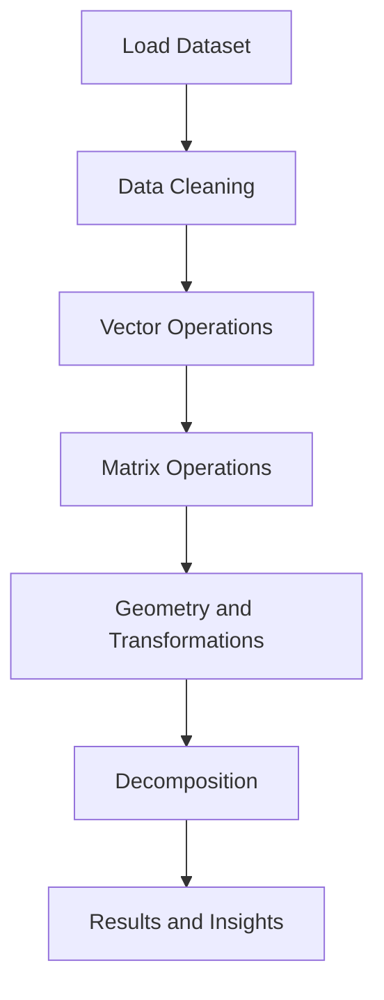

<div align="center">

# Calculative Foundation Mathematics

### Applied Linear Algebra on Real Student Data using Python

<br>

<p align="center">


</p>

<br>

<a href="Calculative_Foundation_Practical.ipynb">

</a>
&nbsp;
<a href="Calculative%20Foundation%20Theory.pdf">

</a>
&nbsp;
<a href="Student_Performance_Dataset.csv">

</a>

</div>

---

## Overview

> **What if you could see student performance as geometry?**

This project applies **linear algebra, vector math, and matrix decomposition** to a real dataset of **25,000 students**. It bridges the gap between mathematical theory and practical implementation. Every concept is demonstrated with Python code, visualizations, and clear interpretations.

The project has two parts:

| Section | Description |
|---------|-------------|
| Theory (PDF) | Covers definitions, formulas, proofs, and visual explanations of every concept |
| Practical (Notebook) | Hands-on Python implementation with code, output, and interpretation |

---

## Dataset Information

This project uses a **Student Performance Dataset** containing academic and demographic data for 25,000 students.

| Property | Details |
|:---------|:--------|
| File | `Student_Performance_Dataset.csv` |
| Size | 25,000 rows, 14 columns |
| Analysis Focus | `math_score`, `science_score`, `english_score` |
| Matrix Shape | 25000 x 3 (score matrix) |
| Language | Python 3.x |

### Column Details

| # | Column | Type | Description |
|:-:|--------|------|-------------|
| 1 | `student_id` | int | Unique identifier |
| 2 | `age` | int | Student age (14-18) |
| 3 | `gender` | str | Gender category |
| 4 | `school_type` | str | Public or Private |
| 5 | `parent_education` | str | Educational background of parents |
| 6 | `study_hours` | float | Daily study hours |
| 7 | `attendance_percentage` | float | Class attendance percentage |
| 8 | `internet_access` | str | Yes or No |
| 9 | `travel_time` | str | Commute duration |
| 10 | `extra_activities` | str | Extracurricular participation |
| 11 | `math_score` | float | Math marks (Vector component 1) |
| 12 | `science_score` | float | Science marks (Vector component 2) |
| 13 | `english_score` | float | English marks (Vector component 3) |
| 14 | `overall_score` | float | Aggregate performance score |

> **Core Idea:** Each student's three subject scores become a 3D vector, turning performance comparison into a geometry problem.

---

## Project Workflow



---

## Part A: Vector and Matrix Fundamentals

Each student's subject scores (Math, Science, English) are represented as a vector in 3D space. This allows us to compare academic profiles using distances, angles, and projections.

### Topics Covered

| Question | Concept | What It Shows |
|:--------:|---------|---------------|
| Q1 | Score Vectors | Students as 3D points |
| Q2 | Norms (L1 and L2) | Total magnitude of scores |
| Q3 | Dot Product and Angle | Similarity between two students |
| Q4 | Cross Product | Direction of difference |
| Q5 | Vector Projection | How much one student overlaps another |

### Key Results

| Metric | Value | Meaning |
|--------|-------|---------|
| Student 1 L2 Norm | 90.23 | Lower overall performance |
| Student 2 L2 Norm | 110.68 | Moderate performance |
| Student 3 L2 Norm | 149.96 | Highest performer |
| Dot Product (S1, S2) | 9964.64 | High similarity |
| Angle (S1, S2) | 3.81 degrees | Nearly identical patterns |

> A small angle means two students have the same strengths and weaknesses, even if one scores higher overall.

---

## Part B: Matrix Operations

The full score matrix (25000 students x 3 subjects) is used for matrix arithmetic and analysis.

### Operations Performed

| Operation | Purpose |
|-----------|---------|
| Matrix Addition | Scale verification |
| Matrix Multiplication (Transpose x Matrix) | Discover subject correlations |
| Transpose | Reorganize from student-wise to subject-wise |
| Covariance Matrix | Measure how subjects vary together |
| Matrix Inverse | Enable deeper mathematical analysis |
| Determinant | Check if the matrix is invertible |

### Key Results

| Metric | Value | Meaning |
|--------|-------|---------|
| Determinant | 9,859,623.82 | Non-zero, so matrix is invertible |
| Interpretation | Subjects are independent | No subject is a perfect combination of others |

---

## Part C: Linear Transformations and Geometry

This section explains how data dimensions grow from simple to complex.

| Dimension | Object | Features Used |
|:---------:|--------|:-------------:|
| 1D | Line | math_score only |
| 2D | Plane | math + science |
| 3D | Space | math + science + english |
| Higher | Hyperplane | all features together |

The notebook includes visualizations showing 2D scatter plots, 3D point clouds, and explanations of hyperplanes.

---

## Part D: Decomposition and Systems

| Technique | Purpose |
|-----------|---------|
| Eigenvalues | Find the main axes of variation in scores |
| Eigenvectors | Direction of maximum spread in data |
| LU Decomposition | Break matrix into simpler factors |
| Systems of Equations | Solve linear systems from the data |

---

## Technologies Used

| Technology | Role |
|:----------:|:----:|
| Python | Core programming language |
| NumPy | Vector and matrix computation |
| Pandas | Data loading and manipulation |
| SciPy | Linear algebra functions (LU, linalg) |
| Matplotlib | 2D and 3D visualization |
| Seaborn | Statistical plotting |
| Jupyter Notebook | Development environment |

---

## Quick Start

```bash
# Clone the repository
git clone https://github.com/DevanshiBachhote2007/Calculative_Foundation_Maths.git
cd Calculative_Foundation_Maths

# Install dependencies
pip install numpy pandas scipy matplotlib seaborn

# Launch the notebook
jupyter notebook Calculative_Foundation_Practical.ipynb
```

---

## Implementation Steps

| Step | What Happens |
|:----:|-------------|
| 01 | Import libraries and load 25K student records |
| 02 | Convert subject scores to 3D vectors |
| 03 | Compute L1 and L2 norms for each student |
| 04 | Calculate dot product and angle between students |
| 05 | Find cross product for directional difference |
| 06 | Project one student vector onto another |
| 07 | Form the full students x subjects matrix |
| 08 | Perform addition, multiplication, transpose |
| 09 | Build 3x3 covariance matrix |
| 10 | Compute matrix inverse |
| 11 | Calculate determinant |
| 12 | Visualize 1D, 2D, 3D, and hyperplane |
| 13 | Perform eigenvalue and LU decomposition |

---

## Learning Outcomes

After completing this project, you will understand:

- How to represent real data as vectors and matrices
- How to compute norms, dot products, angles, and projections
- How to perform matrix addition, multiplication, transpose, and inverse
- How to interpret covariance matrices and determinants
- How dimensionality increases from 1D to higher dimensions
- How to apply linear transformations to datasets
- How to decompose matrices using LU factorization
- How to solve systems of linear equations with Python
- How to connect abstract math to real educational data

---

## Real-World Applications

| Industry | Use Case |
|----------|----------|
| Education | Student clustering, performance prediction |
| Machine Learning | PCA, dimensionality reduction, SVMs |
| Finance | Portfolio optimization, risk analysis |
| Computer Graphics | 3D rendering, transformations, game physics |
| Healthcare | Medical data analysis, outcome modeling |
| Manufacturing | Quality control, process optimization |

---

## Why This Project Matters

Most students learn linear algebra as abstract formulas on paper. This project connects every formula to real student data, so you can see exactly why a determinant matters, what an eigenvector looks like, and how a projection works in practice.

**Theory (PDF) --> Code (Notebook) --> Insight (Results)**

The feedback loop between reading theory and seeing it in action makes the learning stick.

---

## Repository Structure

```
Calculative_Foundation_Maths/
|
|-- Calculative Foundation Theory.pdf       (Mathematical theory document)
|-- Calculative_Foundation_Practical.ipynb  (Python implementation)
|-- Student_Performance_Dataset.csv         (25,000 student records)
|-- README.md                               (This file)
```

---

## Author

**Devanshi Bachhote**

[](https://github.com/DevanshiBachhote2007)

---

<div align="center">

### Preview Projects Explaination

[](https://github.com/DevanshiBachhote2007/Spread-Locator)

---

If you found this project helpful, please give it a star!

</div>
